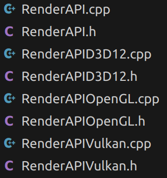

## ZXEngine学习笔记

架构、界面类似unity

### Linux构建运行
原仓库地址：https://github.com/AshenvaleZX/ZXEngine

cmake构建运行：
- 依赖库：手动安装需要的库，locate到需要的.a/.so库文件加到link_libraries里
- libstdc++.so.6: version ‘GLIBCXX_3.4.30‘ not found：本地安装的anaconda覆盖了libstdc++6的版本，手动软链接到/usr/lib/x86_64-linux-gnu/libstdc++.so.6即可
- 用vulkan api：pubh.h:44 ZX_API_SWITCH=1，Tools/glsland_Linux_x86-64需要给执行权限
    - glslang：shader翻译工具，可将glsl/hlsl转换为spir-v通用格式语言，从而兼容vulkan

运行逻辑
- main入口：Entry.cpp，ZXEngine::Game::Launch创建所有的实例，然后进入ZXEngine::Game::Run里的主循环

### 物理PhysZ
碰撞检测：支持球、平面、盒体三种基本形状的碰撞对，SAT
约束求解：比较基础粗暴的方式，发现侵入->修正深度最大的侵入->重复迭代
有sleep机制

物理解算框架和逻辑与unity类似，用collider组件表示碰撞体，rigidbody表示物理实体

待办：
- 尝试把自己的刚体引擎放进来

### 游戏逻辑、lua映射（GamePlay层）
game logic用lua脚本来写，包括start，update逻辑等，GameLogic对象Awake时加载lua代码，然后在相应的Awake/Start/Update/FixedUpdate/OnDestroy中通过CallLuaUpdateFunction调用对应的lua函数。调用lua函数的逻辑使用第三方库实现

LuaManager：负责管理lua运行时状态的类（类似一个lua虚拟机），引擎启动时，执行一些预置的lua init脚本，从而在lua state里生成了一些全局的、共用的变量或函数，有一个全局table AllGameLogic，存的是每个GameLogic映射的对象，可以作为调用Awake/Start/Update/FixedUpdate/OnDestroy的self参数，在执行前被push到lua虚拟机的栈上。

GameLogic awake：
lua wrap

### C++反射

### 窗口管理

### ECS

### 动画/骨骼动画/蒙皮

### Render api/通用管线/rt管线
ZXEngine支持opengl、vulkan、dx12

vulkan特性、相对于opengl的扩展有待学习

### shader/材质系统

### jobsystem（多线程）

### audio